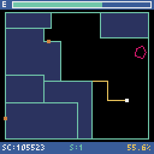

# GEVISE75

A retro-style territory-claiming game.

## Game Overview

The player starts from the outer border of the field and draws lines to claim territory. Clear the stage by claiming **75% or more** of the field.

It is implemented in Python with [Pyxel](https://github.com/kitao/pyxel).

### Basic Rules

- The player can move freely along the outer border or already-claimed area.
- Leave the border, draw a line, and return to the border to claim an enclosed area.
- You miss and lose energy when:
  - a floating enemy, **Drift**, touches your line while you are drawing it;
  - a border-traveling enemy, **Crawler**, touches the player;
  - you touch your own line while drawing.
- The game is over when energy reaches **0**.
- Clearing a stage restores some energy and advances to the next stage.

### Energy System

- Energy naturally decreases over time.
- Completing a line restores energy based on the line length. Longer, riskier routes restore more energy, making bold plays an important strategy.

### Scoring

- Completing a line adds points based on the number of newly claimed cells.
- Each claimed cell is worth **1 point**.
- Areas containing **Drift** are not claimed and do not award points.
- Missing does not reduce the score.
- Stage clear is based on claimed area ratio, not score.

## Controls

| Key | Action |
| --- | --- |
| Arrow keys | Move |
| Z | Confirm / Start game from title / Return to title from game over |
| Q | Return to title while playing |
| ESC | Quit game |

## Note

This is a non-commercial project created as a personal tribute to classic territory-claiming arcade games.
